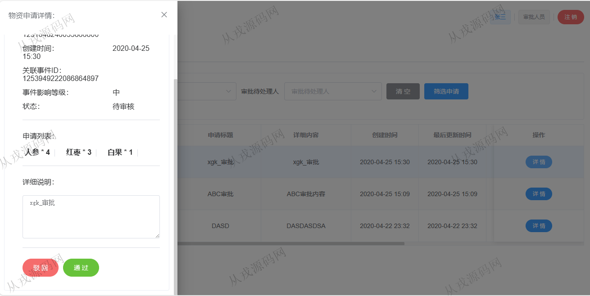

<h1 align="center">180.应急物资保障管理系统</h1>

- <b>完整代码获取地址：从戎源码网 ([https://armycodes.com/](https://armycodes.com/))</b>
- <b>技术探讨、资料分享，请加QQ群：692619798</b> 
- <b>作者微信：19941326836  QQ：952045282</b> 
- <b>承接计算机毕业设计、Java毕业设计、Python毕业设计、深度学习、机器学习</b>
- <b>选题+开题报告+任务书+程序定制+安装调试+论文+答辩ppt 一条龙服务</b>
- <b>所有选题地址 ([https://github.com/YuLin-Coder/AllProjectCatalog](https://github.com/YuLin-Coder/AllProjectCatalog)) </b>

## 项目介绍
基于springboot+vue的应急物资保障管理系统【含报告】：前端 vue、elementui，后端 maven、springmvc、spring、mybatis；角色分为管理员、应急事件响应人员、运输人员、审批人员；集成应急物资、应急事件、审批、应急物资运输等功能于一体的系统。

## 功能模块概述

1. 应急物资，应急物资分类管理模块：
   该模块主要是对应急物资以及其分类进行统一的管理，包含对应急物资的新增，支出，信息更新，删除。并提供了多种筛选方式可以边快速的获取到应急物资的当前情况。针对物资分类也提供了类似的功能。
2. 应急事件管理模块：
   该模块作为应急物资调度的先导而存在，可以通过该模块进行应急事件的建立，维护，并可以按照实际生活中的处理进度，更新某个应急事件的处理状态。进行统一的跟进，同时可以在该界面获取到历史的应急事件以及其处理状态，通过多种方式筛选出指定的数据，然后提供了针对某一个应急事件的物资申请发起的功能，可以为这个事件申请物资。
3. 审批模块：
   该模块主要是配合应急事件管理模块，对来自该模块下建立的申请进行审批，结合实际的情况进行处理，选择通过审批或者驳回。只有经过审批之后，相关的流程才可以继续流转下去。
4. 应急物资运输模块：  
   通过该模块可以对已经通过审批的申请建立物资运输单，进而对申请的物资进行运输工作，并且可以在这个过程中对其进行物资的流转等操作，应急事件管理人员也可以在该模块下选择结束流转一个运输单，表示已经收到了物资。
5. 系统模块：
   通过该模块对用户的信息进行管理，进行登录验证，用户权限判断等操作，并且按照用户的身份为其生成菜单。并记录其操作日志。

## 环境

- <b>IntelliJ IDEA 2021.3</b>

- <b>Mysql 5.7.26</b>

- <b>Node 14.14.0</b>

- <b>Redis 3.0</b>

- <b>JDK 1.8</b>

## 运行截图

